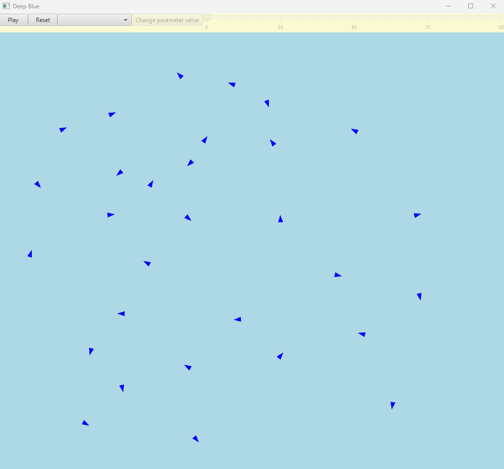
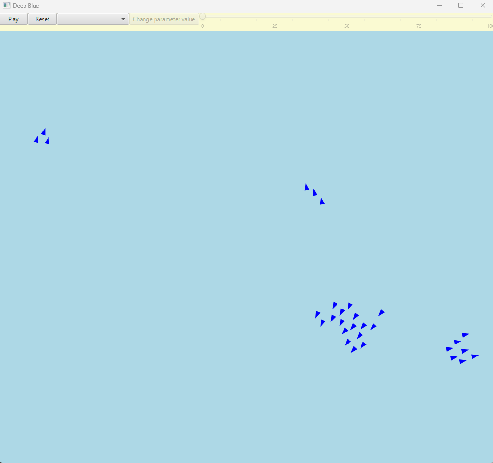
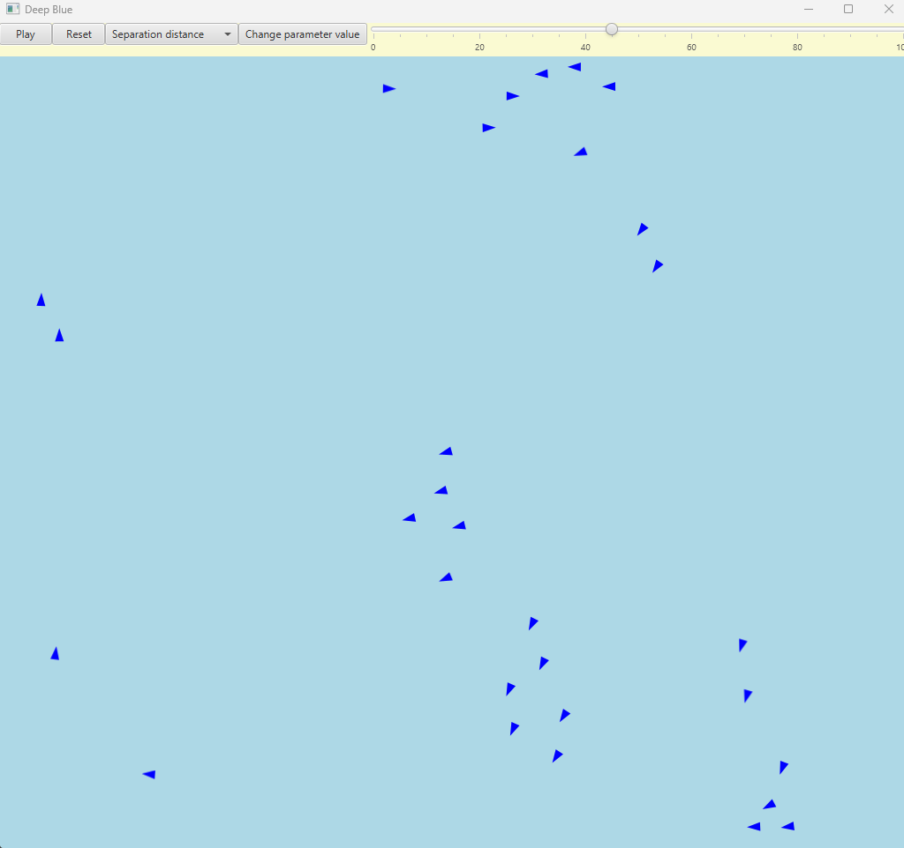

# Deep Blue

The program simulates the flock behaviour in a school of fish. It was written completely in Scala using the ScalaFX library for the GUI elements.

It offers a bunch of tools to alter the simulation with, including pausing and changing some behaviour parameters on the fly. 

Here the desired distance between fish was increased. The are many more parameters to play with.

If one wants to run the same initial setting multiple times the program can also read the initial situation from the configuration text file found on the root that is easy to use.

The .jar file is ready to use and utilizes the config.txt found in the root folder.
